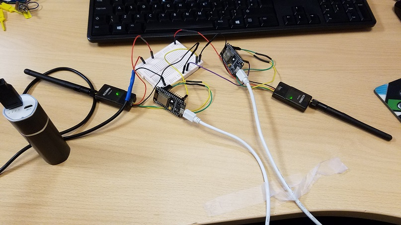

# arduino-telemetry
433MHz 100mw radio telemetry 



## BOM

* 433MHz 100mw RF module x2
* NodeMCU x2

## Wiring

```
      433MHz 100mw
       RF modules                                       NodeMCU
      +-----------+                                  +----------+
      |        TX +------+ RX (PIN 5)    TX   +------+ PIN 5    |
      |           |                                  |          |
      |        RX +------+ TX (PIN 4)    RX   +------+ PIN 4    |
      |           |                                  |      USB +--------+ TERMINAL
      |        5V +------+ 5V                        |          |
      |           |                                  |          |
      |        GND+------+ GND           GND  +------+ GND      |
      +-----------+                                  +----------+
      +-----------+                                  +----------+
      |        TX +------+ RX (PIN 5)    TX   +------+ PIN 5    |
      |           |                                  |          |
      |        RX +------+ TX (PIN 4)    RX   +------+ PIN 4    |
      |           |                                  |      USB +--------+ TERMINAL
      |        5V +------+ 5V                        |          |
      |           |                                  |          |
      |        GND+------+ GND           GND  +------+ GND      |
      +-----------+                                  +----------+
```

## Sketch

https://github.com/dsikar/arduino-telemetry/tree/master/telemetry


